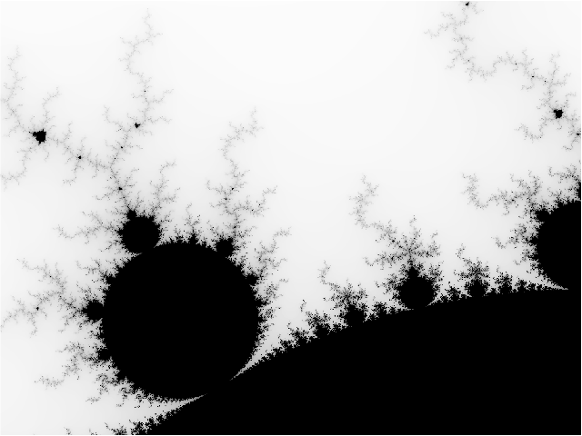

# Mandelbrot in Lua

This repository contains a Lua implementation for generating visualizations of the Mandelbrot set. It is part of a larger project comparing implementations across various programming languages.

The script can render the Mandelbrot set directly to the terminal as ASCII art or produce a data file for `gnuplot` to generate a high-resolution PNG image.

### Other Language Implementations

This project compares the performance and features of Mandelbrot set generation in different languages.

| Language  | Repository                                               | Key Features                                 |
| :-------- | :------------------------------------------------------- | :------------------------------------------- |
| **Lua**   | `mandelbrot-lua` (This Repo)                                       | Single-threaded, Gnuplot-based PNG           |
| Rust      | [mandelbrot-rs](https://github.com/jesper-olsen/mandelbrot-rs)     | Multi-threaded, Direct PNG output            |
| Python    | [mandelbrot-py](https://github.com/jesper-olsen/mandelbrot-py)     | Multi-threaded, Direct PNG output            |
| Mojo      | [mandelbrot-mojo](https://github.com/jesper-olsen/mandelbrot-mojo) | Multi-threaded, Gnuplot-based PNG            |
| Erlang    | [mandelbrot_erl](https://github.com/jesper-olsen/mandelbrot_erl)   | Multi-process, Direct PNG output   |
| Fortran   | [mandelbrot-f](https://github.com/jesper-olsen/mandelbrot-f)       | Single-threaded, Gnuplot-based PNG           |
| Nushell   | [mandelbrot-nu](https://github.com/jesper-olsen/mandelbrot-nu)     | Single-threaded, Gnuplot-based PNG           |
| R         | [mandelbrot-R](https://github.com/jesper-olsen/mandelbrot-R)       | Single-threaded, Gnuplot-based PNG           |
| Tcl       | [mandelbrot-tcl](https://github.com/jesper-olsen/mandelbrot-tcl)   | Single-threaded, Gnuplot-based PNG           |

---

## Prerequisites

You will need the following installed to run this script:

1.  **Lua**: The script was tested with Lua 5.4.
2.  **Gnuplot**: Required *only* for generating PNG images from the data file.

---

## Usage

The script can be configured via command-line arguments using a `key=value` format.

### 1. ASCII Art Output

To render the Mandelbrot set directly in your terminal, simply run the script.

``` sh
lua mandelbrot.lua
```
```
....................................................................................................
....................................................................................................
....................................................................................................
....................................................................................................
....................................................................................................
....................................................................................................
..............................................................................._....................
..............................................................................._....................
................................................................................_...................
..............................................................................._....................
....................................................................................................
....................................................................................._.._.__........
.........................................................................................._.........
..........................................................................................._..._....
....................................................................................................
._..................................................................................................
.._.................................................................................................
.........................a..........................................................................
............................................................................................._......
.._......................_....................................................................._M...
..............................................................................................._M_..
........................_._....................................................................__...
......._...............__................................................................._.........
....._MM_............._............................................................................_
......_M__._.............................................................................._........_
......._..._........__..............................................................................
...._......._._........................_............................................................
...._........___...._...............................................................................
...._..........___._...................._...........................................................
............._....__..._........................................................................._.a
...................._......................................................................_...._2__
...................._._.................._..............................................__..a....__a
....................____..._..........__._................................................_.a_....__
...................___.._.._.._......._.._....._................_......................_..a__..____a
.....................__._.._.__........_........................................._...a___a_a__._aa_W
.....................____.__._........__......................__.................._....__.._a___MaWM
....................__2M_a_a...._......_____..........................................._..__aaaMMMMM
....................__MMWaaa__........____._..........................................._..M_2MMMMMMM
................._..__MMMMM__2.._._.....a_...................._............................_MMMMMMMM
.................aaa_aMMMMMM__2._a.._..aa_....................._._._......................aaaMMMMMMM
.............__a____WMMMMMMM__2__a_._a__M__........................__..__.._............._2__MMMMMMM
............_..2...__MMMMMMM___M_M_Wa_MaM_.........................a___a.._..........a..__MaMMMMMMMM
...................__MMMMMMaMMMMMM2M_MMMa_2........................____M_.............__..aaMMMMMMMM
.................___a_MMMMMMMMMMMMMMM2MMMM_...._.....................__2a_aa..._..........a_MMMMMMMM
....................___aMMMMMMMMMMMMMMMMM_2.._....................___a____W2..._.........._aMMMMMMMM
...._........_..._.___WMMMMMMMMMMMMMMMMMa__.___................_.__a__aa__......__........__aMMMMMMM
........_......_.___MMMMMMMMMMMMMMMMMMMMMM2____2_......._.........._._2Ma_a_.....a_........_aMMMMMMM
.........._.....__aaaMMMMMMMMMMMMMMMMMMMMMaa_a_....................._aMMM2MM..M.M2Ma..W_...__aMMMMMM
.........a_......_MMMMMMMMMMMMMMMMMMMMMMMMMMMa....................___2aMMMWW_.._a_W___2M______aMMMMM
.........._......__2MMMMMMMMMMMMMMMMMMMMMMMM2__.........._.._.....MaaWMMMMM2_a..MMMM___M_2M_2___MMMM
..........__..a__W2MMMMMMMMMMMMMMMMMMMMMMMMMa_W_..........__a._....MaMMMMMMM_MM_MMMM_MMMaaM2MWMMMMMM
......_._____._W__2MMMMMMMMMMMMMMMMMMMMMMMMMM___.........__aaW2_..._2MMMMMMM__MWMMMMMMMMMMMMMMMMMMMM
.......2_.____aaMaMMMMMMMMMMMMMMMMMMMMMMMMMMMW_..........__MW___.____2MMMMMaaMMMMMMMMMMMMMMMMMMMMMMM
...._._....._a2MMMMMMMMMMMMMMMMMMMMMMMMMMMMMMa_._..._.....2_MMM__2M_a_MMMMMMMMMMMMMMMMMMMMMMMMMMMMMM
....___....._aaMMMMMMMMMMMMMMMMMMMMMMMMMMMMMM_M......W...._2MMM__MMa2MMMMMMMMMMMMMMMMMMMMMMMMMMMMMMM
._..._......___aMMMMMMMMMMMMMMMMMMMMMMMMMMMMMM_......_2aM___MMMaMMMMMMMMMMMMMMMMMMMMMMMMMMMMMMMMMMMM
............._____MMMMMMMMMMMMMMMMMMMMMMMMMMM_W_....._aMM_2_MMMMMMMMMMMMMMMMMMMMMMMMMMMMMMMMMMMMMMMM
.........._....._2MMMMMMMMMMMMMMMMMMMMMMMMMMMM_..._2M_MMMMMMMMMMMMMMMMMMMMMMMMMMMMMMMMMMMMMMMMMMMMMM
................_MMMMMMMMMMMMMMMMMMMMMMMMMMMM2_.2._MaMaMMMMMMMMMMMMMMMMMMMMMMMMMMMMMMMMMMMMMMMMMMMMM
............_...__MMMMMMMMMMMMMMMMMMMMMMMMMMM____MaMMMMMMMMMMMMMMMMMMMMMMMMMMMMMMMMMMMMMMMMMMMMMMMMM
............______2MMMMMMMMMMMMMMMMMMMMMMMMM___MMMMMMMMMMMMMMMMMMMMMMMMMMMMMMMMMMMMMMMMMMMMMMMMMMMMM
............._a__WMMMMMMMMMMMMMMMMMMMMMMMMMWM_MMMMMMMMMMMMMMMMMMMMMMMMMMMMMMMMMMMMMMMMMMMMMMMMMMMMMM
............____2MMaMMMMMMMMMMMMMMMMMMMMMMM___MMMMMMMMMMMMMMMMMMMMMMMMMMMMMMMMMMMMMMMMMMMMMMMMMMMMMM
...........a._..___aMMMMMMMMMMMMMMMMMMMMMMM_MMMMMMMMMMMMMMMMMMMMMMMMMMMMMMMMMMMMMMMMMMMMMMMMMMMMMMMM
............._....__aMMMMMMMMMMMMMMMMMMMMMMMMMMMMMMMMMMMMMMMMMMMMMMMMMMMMMMMMMMMMMMMMMMMMMMMMMMMMMMM
........__._.....W__2MMMMMMMMMMMMMMMMMMMMMMMMMMMMMMMMMMMMMMMMMMMMMMMMMMMMMMMMMMMMMMMMMMMMMMMMMMMMMMM
........_......._._M2_WMMMMMMMMMMMMMMMMMMMMMMMMMMMMMMMMMMMMMMMMMMMMMMMMMMMMMMMMMMMMMMMMMMMMMMMMMMMMM
.................aa..WMMMMMMMMMMMMMMMMMMMMMMMMMMMMMMMMMMMMMMMMMMMMMMMMMMMMMMMMMMMMMMMMMMMMMMMMMMMMMM
.....................___aM2MMMMMMMMMMMMMMMMMMMMMMMMMMMMMMMMMMMMMMMMMMMMMMMMMMMMMMMMMMMMMMMMMMMMMMMMM
...............__...._2_a__aaMMaaaMMMMMMMMMMMMMMMMMMMMMMMMMMMMMMMMMMMMMMMMMMMMMMMMMMMMMMMMMMMMMMMMMM
...................._..._._M___MMMMMMMMMMMMMMMMMMMMMMMMMMMMMMMMMMMMMMMMMMMMMMMMMMMMMMMMMMMMMMMMMMMMM
..........................____aMMMMMMMMMMMMMMMMMMMMMMMMMMMMMMMMMMMMMMMMMMMMMMMMMMMMMMMMMMMMMMMMMMMMM
........................._2_aMMMMMMMMMMMMMMMMMMMMMMMMMMMMMMMMMMMMMMMMMMMMMMMMMMMMMMMMMMMMMMMMMMMMMMM
.......................MaMMMMMMMMMMMMMMMMMMMMMMMMMMMMMMMMMMMMMMMMMMMMMMMMMMMMMMMMMMMMMMMMMMMMMMMMMMM
...................a2_._M_2MMMMMMMMMMMMMMMMMMMMMMMMMMMMMMMMMMMMMMMMMMMMMMMMMMMMMMMMMMMMMMMMMMMMMMMMM
```

You can change the view and resolution by passing parameters:
```sh
# Zoom in on a different area with a wider view
lua mandelbrot.lua width=120 ll_x=-0.75 ll_y=0.1 ur_x=-0.74 ur_y=0.11
```

### 2. PNG Image Generation

To create a high-resolution PNG, you first generate a data file and then process it with `gnuplot`.

**Step 1: Generate the data file**

Set `png=1` and specify the desired dimensions. Redirect the output to a file.

```sh
lua mandelbrot.lua png=1 width=1000 height=750 > image.dat
```

**Step 2: Run gnuplot**

This will read `image.dat` and create `mandelbrot.png`.

```sh
gnuplot topng.gp
```

The result is a high-quality `mandelbrot.png` image.



## Performance

Benchmarks were run on an **Apple M1** system with **Lua 5.4.7**.

**Generating a 1000x750 data file:**
```sh
% time lua mandelbrot.lua png=1 width=1000 height=750 > image.dat
3.98s user 0.09s system 89% cpu 4.546 total
```

**Generating a 5000x5000 data file:**
```sh
% time lua mandelbrot.lua png=1 width=5000 height=5000 > image.dat
129.62s user 3.37s system 84% cpu 2:38.18 total
```
```sh
% lua -v
Lua 5.4.7  Copyright (C) 1994-2024 Lua.org, PUC-Rio

% sysctl -n machdep.cpu.brand_string
Apple M1
```
